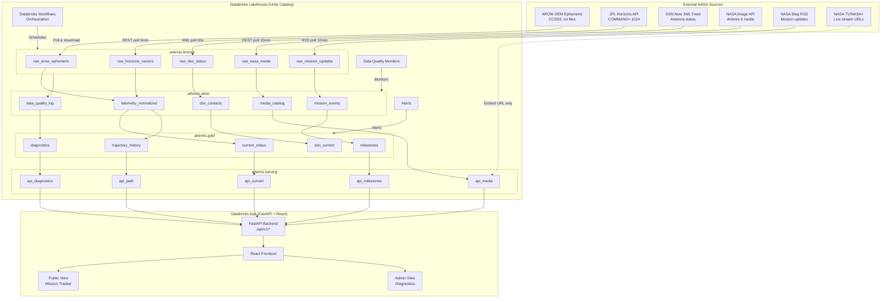

# Artemis II Mission Tracker - Architecture & Implementation Package

## 1. Executive Summary

A production-grade, real-time Artemis II mission tracker built on Databricks as the data backbone, with a React frontend deployed as a Databricks App. The system ingests real NASA data from AROW ephemeris files, JPL Horizons API, DSN XML feeds, and NASA media APIs, processes it through a medallion lakehouse architecture, and serves it through curated gold/serving tables consumed by the frontend.

**Mission context (LIVE):** Artemis II launched April 1, 2026. We are currently on Flight Day 4. Lunar flyby is April 6. Splashdown expected April 10. The ~10-day mission window means we need to build fast and operate live.

**Key design principles:**
- Databricks is the system of record - frontend never scrapes sources directly
- Only real NASA data - no simulated telemetry, no fabricated engineering channels
- Resilient ingestion - raw payloads archived, schemas versioned, source outages tolerated
- Two views: public mission tracker + internal ops/diagnostics console

---

## 2. Assumptions and Constraints

### Confirmed Facts
- Artemis II launched April 1, 2026 from KSC
- Mission duration: ~10 days (splashdown ~April 10)
- Trajectory: 2 Earth orbits, TLI, lunar flyby at ~4,066 miles, free-return to Earth
- AROW publishes OEM ephemeris files (CCSDS standard, J2000 frame, 4-min intervals)
- JPL Horizons has Orion as COMMAND='-1024' with vector ephemeris
- DSN Now provides XML feed updated every 5 seconds
- NASA Image/Video Library API is public (images-api.nasa.gov)
- AROW is a Unity WebGL app at nasa.gov/missions/artemis-ii/arow/

### Assumptions
- A1: We have a Databricks workspace with Unity Catalog enabled (fe-vm profile)
- A2: We can deploy a Databricks App (FastAPI + React)
- A3: AROW ephemeris ZIP files are periodically updated and downloadable via HTTP
- A4: JPL Horizons API is available without authentication (rate-limited, be polite)
- A5: DSN XML feed is at a discoverable endpoint (needs browser DevTools confirmation)
- A6: We will poll/download sources from Databricks notebooks, not from the frontend

### Key Risks
- R1: AROW ephemeris download URL may change or require manual discovery
- R2: No documented REST API behind AROW Unity app - we rely on ephemeris files + Horizons
- R3: DSN XML endpoint URL needs reverse-engineering from browser network tab
- R4: Source schemas are undocumented - we must version and tolerate drift
- R5: Mission is live NOW - build speed is critical

---

## 3. Official Source Inventory

### MUST-HAVE Sources

| # | Source | URL | Format | Refresh | Ingestion | Confidence | Schema Drift Risk |
|---|--------|-----|--------|---------|-----------|------------|-------------------|
| S1 | AROW OEM Ephemeris | nasa.gov/trackartemis (download link) | CCSDS OEM text (.txt in ZIP) | Periodic (hours?) | Poll download, unzip, parse | HIGH | LOW (CCSDS standard) |
| S2 | JPL Horizons API | ssd.jpl.nasa.gov/api/horizons.api | JSON/text | On-demand query | Scheduled poll every 5 min | HIGH | LOW (stable API) |
| S3 | DSN Now Feed | eyes.nasa.gov/apps/dsn-now/ (XML endpoint TBD) | XML | 5 seconds | Poll every 30 sec | MEDIUM | MEDIUM (undocumented) |

### OPTIONAL Sources

| # | Source | URL | Format | Refresh | Ingestion | Confidence | Schema Drift Risk |
|---|--------|-----|--------|---------|-----------|------------|-------------------|
| S4 | NASA Image/Video API | images-api.nasa.gov/search?q=artemis+II | JSON | Minutes-hours | Poll every 15 min | HIGH | LOW (documented API) |
| S5 | NASA Blogs/Updates | nasa.gov/blogs/missions/ | HTML/RSS | Hours | Poll RSS every 10 min | HIGH | MEDIUM |
| S6 | NASA TV / NASA+ Embed | nasa.gov/live or YouTube NASA channel | Video embed URL | Live stream | Store embed URL only | HIGH | LOW |

### REJECTED Sources
- Any simulated telemetry or "demo" data generators
- Unofficial community APIs (artemis.cdnspace.ca) - not authoritative
- Internal Orion subsystem telemetry (not publicly exposed by NASA)
- Social media scraping

---

## 4. Architecture Diagram



---

## 5. Databricks Data Model

### Catalog: `artemis`
### Schemas: `bronze`, `silver`, `gold`, `serving`

---

### 5.1 Bronze Layer (Raw, Append-Only)

#### `artemis.bronze.raw_arow_ephemeris`
- **Purpose:** Raw CCSDS OEM ephemeris text ingested from AROW downloads
- **Grain:** One row per state vector (position + velocity at a timestamp)
- **Dedupe:** Hash of (epoch_utc, x_km, y_km, z_km)
- **Freshness:** Updated when new ephemeris ZIP is detected (hours)

```sql
CREATE TABLE artemis.bronze.raw_arow_ephemeris (
  ingest_id         STRING       COMMENT 'UUID per ingest batch',
  ingest_ts         TIMESTAMP    COMMENT 'When we ingested this record',
  source_file       STRING       COMMENT 'Original filename from ZIP',
  source_url        STRING       COMMENT 'Download URL used',
  file_hash_sha256  STRING       COMMENT 'SHA256 of source file',
  epoch_utc         STRING       COMMENT 'Raw epoch string from OEM',
  x_km              STRING       COMMENT 'Raw X position (km) - stored as string for fidelity',
  y_km              STRING       COMMENT 'Raw Y position',
  z_km              STRING       COMMENT 'Raw Z position',
  vx_km_s           STRING       COMMENT 'Raw X velocity (km/s)',
  vy_km_s           STRING       COMMENT 'Raw Y velocity',
  vz_km_s           STRING       COMMENT 'Raw Z velocity',
  raw_line          STRING       COMMENT 'Original text line from OEM file',
  oem_header        STRING       COMMENT 'Full OEM header/metadata block',
  _file_modification_time TIMESTAMP COMMENT 'Source file timestamp'
)
USING DELTA
PARTITIONED BY (DATE(ingest_ts))
TBLPROPERTIES ('quality' = 'bronze', 'delta.autoOptimize.optimizeWrite' = 'true');
```

#### `artemis.bronze.raw_horizons_vectors`
- **Purpose:** Raw JSON responses from JPL Horizons API for Orion (COMMAND=-1024)
- **Grain:** One row per API response
- **Dedupe:** Hash of (query_start_time, query_stop_time, response_hash)
- **Freshness:** Every 5 minutes

```sql
CREATE TABLE artemis.bronze.raw_horizons_vectors (
  ingest_id         STRING       COMMENT 'UUID per request',
  ingest_ts         TIMESTAMP    COMMENT 'When we called the API',
  api_url           STRING       COMMENT 'Full request URL',
  http_status       INT          COMMENT 'Response status code',
  response_hash     STRING       COMMENT 'SHA256 of response body',
  response_json     STRING       COMMENT 'Full JSON response body',
  query_command     STRING       COMMENT 'Horizons COMMAND parameter',
  query_start_time  STRING       COMMENT 'START_TIME parameter',
  query_stop_time   STRING       COMMENT 'STOP_TIME parameter',
  query_step_size   STRING       COMMENT 'STEP_SIZE parameter',
  api_version       STRING       COMMENT 'Horizons API version from signature',
  latency_ms        LONG         COMMENT 'Request latency in milliseconds'
)
USING DELTA
PARTITIONED BY (DATE(ingest_ts))
TBLPROPERTIES ('quality' = 'bronze');
```

#### `artemis.bronze.raw_dsn_status`
- **Purpose:** Raw DSN XML snapshots (antenna contacts, signal strength, spacecraft)
- **Grain:** One row per XML poll
- **Freshness:** Every 30 seconds

```sql
CREATE TABLE artemis.bronze.raw_dsn_status (
  ingest_id         STRING,
  ingest_ts         TIMESTAMP,
  source_url        STRING,
  http_status       INT,
  response_hash     STRING,
  raw_xml           STRING    COMMENT 'Full XML response body',
  latency_ms        LONG
)
USING DELTA
PARTITIONED BY (DATE(ingest_ts))
TBLPROPERTIES ('quality' = 'bronze');
```

#### `artemis.bronze.raw_nasa_media`
- **Purpose:** NASA Image/Video API search results for Artemis II
- **Grain:** One row per API response
- **Freshness:** Every 15 minutes

```sql
CREATE TABLE artemis.bronze.raw_nasa_media (
  ingest_id         STRING,
  ingest_ts         TIMESTAMP,
  api_url           STRING,
  http_status       INT,
  response_json     STRING,
  total_hits        INT,
  latency_ms        LONG
)
USING DELTA
PARTITIONED BY (DATE(ingest_ts))
TBLPROPERTIES ('quality' = 'bronze');
```

#### `artemis.bronze.raw_mission_updates`
- **Purpose:** NASA blog posts / RSS entries about Artemis II flight days
- **Grain:** One row per blog post
- **Freshness:** Every 10 minutes

```sql
CREATE TABLE artemis.bronze.raw_mission_updates (
  ingest_id         STRING,
  ingest_ts         TIMESTAMP,
  source_url        STRING,
  entry_id          STRING    COMMENT 'RSS entry GUID or URL',
  title             STRING,
  published_at      TIMESTAMP,
  content_html      STRING,
  content_text      STRING,
  author            STRING,
  response_hash     STRING
)
USING DELTA
TBLPROPERTIES ('quality' = 'bronze');
```

---

### 5.2 Silver Layer (Normalized, Typed, Deduplicated)

#### `artemis.silver.telemetry_normalized`
- **Purpose:** Unified, typed, deduplicated state vectors from AROW + Horizons
- **Grain:** One row per unique (epoch_utc, source)
- **Dedupe:** Prefer AROW when both available; keep both with source tag
- **Freshness:** Minutes after bronze update

```sql
CREATE TABLE artemis.silver.telemetry_normalized (
  telemetry_id      STRING       COMMENT 'Deterministic hash of epoch_utc + source',
  epoch_utc         TIMESTAMP    COMMENT 'Canonical UTC timestamp',
  mission_elapsed_s DOUBLE       COMMENT 'Seconds since launch (2026-04-01T16:42:00Z)',
  source            STRING       COMMENT 'arow_oem | horizons_vectors',
  ref_frame         STRING       COMMENT 'J2000',
  x_km              DOUBLE       COMMENT 'X position Earth-centered (km)',
  y_km              DOUBLE       COMMENT 'Y position (km)',
  z_km              DOUBLE       COMMENT 'Z position (km)',
  vx_km_s           DOUBLE       COMMENT 'X velocity (km/s)',
  vy_km_s           DOUBLE       COMMENT 'Y velocity (km/s)',
  vz_km_s           DOUBLE       COMMENT 'Z velocity (km/s)',
  distance_earth_km DOUBLE       COMMENT 'Computed: sqrt(x^2+y^2+z^2)',
  distance_moon_km  DOUBLE       COMMENT 'Computed: distance to Moon (from Horizons Moon vectors)',
  speed_km_s        DOUBLE       COMMENT 'Computed: sqrt(vx^2+vy^2+vz^2)',
  speed_km_h        DOUBLE       COMMENT 'speed_km_s * 3600',
  lat_deg           DOUBLE       COMMENT 'Geocentric latitude',
  lon_deg           DOUBLE       COMMENT 'Geocentric longitude',
  altitude_km       DOUBLE       COMMENT 'Distance from Earth surface (distance_earth_km - 6371)',
  is_latest         BOOLEAN      COMMENT 'True for the most recent record per source',
  ingest_ts         TIMESTAMP    COMMENT 'When silver record was created',
  bronze_ingest_id  STRING       COMMENT 'Lineage back to bronze'
)
USING DELTA
PARTITIONED BY (DATE(epoch_utc))
CLUSTER BY (epoch_utc)
TBLPROPERTIES ('quality' = 'silver');
```

#### `artemis.silver.mission_events`
- **Purpose:** Timeline of mission milestones and events
- **Grain:** One row per event
- **Sources:** NASA blog posts, known mission plan milestones, derived from telemetry

```sql
CREATE TABLE artemis.silver.mission_events (
  event_id          STRING,
  event_ts          TIMESTAMP    COMMENT 'When the event occurred',
  event_type        STRING       COMMENT 'milestone | blog_update | maneuver | phase_change',
  event_name        STRING       COMMENT 'e.g. Launch, TLI, Lunar Flyby, Splashdown',
  description       STRING,
  source            STRING       COMMENT 'mission_plan | nasa_blog | derived',
  source_url        STRING,
  phase             STRING       COMMENT 'pre_launch | earth_orbit | transit_out | lunar_flyby | transit_return | reentry',
  is_completed      BOOLEAN,
  actual_ts         TIMESTAMP    COMMENT 'Actual time if event has occurred',
  planned_ts        TIMESTAMP    COMMENT 'Planned time from mission plan',
  ingest_ts         TIMESTAMP
)
USING DELTA
TBLPROPERTIES ('quality' = 'silver');
```

#### `artemis.silver.dsn_contacts`
- **Purpose:** Parsed DSN antenna contact events with Orion
- **Grain:** One row per (station, dish, timestamp)

```sql
CREATE TABLE artemis.silver.dsn_contacts (
  contact_id        STRING,
  timestamp_utc     TIMESTAMP,
  station           STRING       COMMENT 'goldstone | canberra | madrid',
  dish_name         STRING       COMMENT 'DSS-14, DSS-43, etc.',
  spacecraft        STRING       COMMENT 'Filter for Orion/Artemis II',
  signal_type       STRING       COMMENT 'uplink | downlink | both',
  frequency_mhz     DOUBLE,
  power_dbm         DOUBLE,
  data_rate_bps     DOUBLE,
  range_km          DOUBLE,
  is_active         BOOLEAN,
  ingest_ts         TIMESTAMP,
  bronze_ingest_id  STRING
)
USING DELTA
PARTITIONED BY (DATE(timestamp_utc))
TBLPROPERTIES ('quality' = 'silver');
```

#### `artemis.silver.media_catalog`
- **Purpose:** Deduplicated catalog of Artemis II images and videos
- **Grain:** One row per NASA media asset (nasa_id)

```sql
CREATE TABLE artemis.silver.media_catalog (
  nasa_id           STRING       COMMENT 'Unique NASA media ID',
  title             STRING,
  description       STRING,
  media_type        STRING       COMMENT 'image | video',
  date_created      TIMESTAMP,
  thumbnail_url     STRING,
  full_url          STRING,
  keywords          ARRAY<STRING>,
  center            STRING       COMMENT 'NASA center (JSC, KSC, etc.)',
  first_seen_ts     TIMESTAMP,
  last_updated_ts   TIMESTAMP
)
USING DELTA
TBLPROPERTIES ('quality' = 'silver');
```

#### `artemis.silver.data_quality_log`
- **Purpose:** Per-ingest quality metrics for monitoring and alerting
- **Grain:** One row per (source, ingest_batch)

```sql
CREATE TABLE artemis.silver.data_quality_log (
  quality_id        STRING,
  ingest_ts         TIMESTAMP,
  source            STRING       COMMENT 'arow_oem | horizons | dsn | media | blog',
  ingest_id         STRING       COMMENT 'FK to bronze ingest_id',
  record_count      INT,
  null_count_map    MAP<STRING, INT>   COMMENT '{column_name: null_count}',
  duplicate_count   INT,
  parse_error_count INT,
  schema_columns    ARRAY<STRING>      COMMENT 'Columns seen in this batch',
  schema_hash       STRING             COMMENT 'Hash of column names+types for drift detection',
  freshness_lag_s   DOUBLE             COMMENT 'Seconds between source timestamp and ingest',
  http_status       INT,
  latency_ms        LONG,
  is_healthy        BOOLEAN
)
USING DELTA
PARTITIONED BY (source)
TBLPROPERTIES ('quality' = 'silver');
```

---

### 5.3 Gold Layer (Business-Ready, Aggregated)

#### `artemis.gold.current_status`
- **Purpose:** Single-row view of Orion's current state - the primary API source
- **Grain:** Single row, overwritten each refresh
- **Freshness:** Within 5 minutes of latest data

```sql
CREATE OR REPLACE VIEW artemis.gold.current_status AS
WITH latest AS (
  SELECT * FROM artemis.silver.telemetry_normalized
  WHERE is_latest = true
  ORDER BY epoch_utc DESC
  LIMIT 1
),
phase AS (
  SELECT phase, event_name FROM artemis.silver.mission_events
  WHERE is_completed = true
  ORDER BY event_ts DESC
  LIMIT 1
)
SELECT
  l.epoch_utc                              AS last_update_utc,
  l.mission_elapsed_s,
  CONCAT(
    FLOOR(l.mission_elapsed_s / 86400), 'd ',
    FLOOR(MOD(l.mission_elapsed_s, 86400) / 3600), 'h ',
    FLOOR(MOD(l.mission_elapsed_s, 3600) / 60), 'm'
  )                                        AS mission_elapsed_display,
  p.phase                                  AS current_phase,
  p.event_name                             AS last_milestone,
  l.distance_earth_km,
  ROUND(l.distance_earth_km * 0.621371, 0) AS distance_earth_miles,
  l.distance_moon_km,
  ROUND(l.distance_moon_km * 0.621371, 0)  AS distance_moon_miles,
  l.speed_km_h,
  ROUND(l.speed_km_h * 0.621371, 0)        AS speed_mph,
  l.x_km, l.y_km, l.z_km,
  l.vx_km_s, l.vy_km_s, l.vz_km_s,
  l.lat_deg, l.lon_deg, l.altitude_km,
  l.source                                 AS data_source,
  l.ingest_ts                              AS data_freshness_ts,
  TIMESTAMPDIFF(SECOND, l.ingest_ts, CURRENT_TIMESTAMP()) AS staleness_seconds
FROM latest l
CROSS JOIN phase p;
```

#### `artemis.gold.trajectory_history`
- **Purpose:** Full trajectory path for visualization (downsampled for performance)
- **Grain:** One row per 4-minute epoch
- **Freshness:** Same as silver telemetry

```sql
CREATE OR REPLACE VIEW artemis.gold.trajectory_history AS
SELECT
  epoch_utc,
  mission_elapsed_s,
  x_km, y_km, z_km,
  distance_earth_km,
  distance_moon_km,
  speed_km_h,
  source
FROM artemis.silver.telemetry_normalized
WHERE source = 'arow_oem'
   OR (source = 'horizons_vectors' AND NOT EXISTS (
     SELECT 1 FROM artemis.silver.telemetry_normalized a
     WHERE a.source = 'arow_oem'
       AND ABS(TIMESTAMPDIFF(SECOND, a.epoch_utc, artemis.silver.telemetry_normalized.epoch_utc)) < 120
   ))
ORDER BY epoch_utc;
```

#### `artemis.gold.milestones`
- **Purpose:** Mission milestone timeline for UI
- **Grain:** One row per milestone

```sql
CREATE OR REPLACE VIEW artemis.gold.milestones AS
SELECT
  event_id,
  event_name,
  description,
  phase,
  planned_ts,
  actual_ts,
  is_completed,
  CASE WHEN is_completed THEN 'completed'
       WHEN planned_ts <= CURRENT_TIMESTAMP() THEN 'in_progress'
       ELSE 'upcoming'
  END AS status
FROM artemis.silver.mission_events
WHERE event_type = 'milestone'
ORDER BY COALESCE(actual_ts, planned_ts);
```

#### `artemis.gold.diagnostics`
- **Purpose:** Operational health dashboard for admin view
- **Grain:** One row per source per check window

```sql
CREATE OR REPLACE VIEW artemis.gold.diagnostics AS
SELECT
  source,
  MAX(ingest_ts) AS last_ingest_ts,
  TIMESTAMPDIFF(SECOND, MAX(ingest_ts), CURRENT_TIMESTAMP()) AS seconds_since_last_ingest,
  COUNT(*) AS ingests_last_hour,
  SUM(record_count) AS records_last_hour,
  SUM(parse_error_count) AS parse_errors_last_hour,
  SUM(duplicate_count) AS duplicates_last_hour,
  AVG(freshness_lag_s) AS avg_freshness_lag_s,
  AVG(latency_ms) AS avg_latency_ms,
  COUNT(DISTINCT schema_hash) AS schema_versions_seen,
  SUM(CASE WHEN NOT is_healthy THEN 1 ELSE 0 END) AS unhealthy_ingests,
  CASE
    WHEN TIMESTAMPDIFF(SECOND, MAX(ingest_ts), CURRENT_TIMESTAMP()) > 600 THEN 'CRITICAL'
    WHEN TIMESTAMPDIFF(SECOND, MAX(ingest_ts), CURRENT_TIMESTAMP()) > 300 THEN 'WARNING'
    ELSE 'OK'
  END AS health_status
FROM artemis.silver.data_quality_log
WHERE ingest_ts >= CURRENT_TIMESTAMP() - INTERVAL 1 HOUR
GROUP BY source;
```

---

### 5.4 Serving Layer (Views optimized for API consumption)

#### `artemis.serving.api_current`
```sql
CREATE OR REPLACE VIEW artemis.serving.api_current AS
SELECT * FROM artemis.gold.current_status;
```

#### `artemis.serving.api_path`
```sql
CREATE OR REPLACE VIEW artemis.serving.api_path AS
SELECT
  epoch_utc, mission_elapsed_s,
  x_km, y_km, z_km,
  distance_earth_km, distance_moon_km, speed_km_h
FROM artemis.gold.trajectory_history;
```

#### `artemis.serving.api_milestones`
```sql
CREATE OR REPLACE VIEW artemis.serving.api_milestones AS
SELECT * FROM artemis.gold.milestones;
```

#### `artemis.serving.api_media`
```sql
CREATE OR REPLACE VIEW artemis.serving.api_media AS
SELECT
  nasa_id, title, description, media_type,
  date_created, thumbnail_url, full_url
FROM artemis.silver.media_catalog
ORDER BY date_created DESC
LIMIT 50;
```

#### `artemis.serving.api_diagnostics`
```sql
CREATE OR REPLACE VIEW artemis.serving.api_diagnostics AS
SELECT * FROM artemis.gold.diagnostics;
```

---

## 6. Ingestion Design

### 6.1 Job Graph (Databricks Workflows)

```
artemis_ingestion_workflow
├── Task 1: ingest_horizons_vectors    (every 5 min)
├── Task 2: ingest_arow_ephemeris      (every 30 min, check for new file)
├── Task 3: ingest_dsn_status          (every 30 sec - streaming or micro-batch)
├── Task 4: ingest_nasa_media          (every 15 min)
├── Task 5: ingest_mission_updates     (every 10 min)
└── Task 6: process_silver_gold        (triggered after any bronze task)
    ├── Subtask 6a: normalize_telemetry
    ├── Subtask 6b: parse_dsn_contacts
    ├── Subtask 6c: update_media_catalog
    ├── Subtask 6d: derive_mission_events
    ├── Subtask 6e: log_data_quality
    └── Subtask 6f: refresh_gold_views
```

### 6.2 Horizons Ingestion (Primary Telemetry Source)

```python
# notebooks/ingest_horizons.py
import requests, hashlib, json, uuid
from datetime import datetime, timedelta, timezone
from pyspark.sql import Row

HORIZONS_API = "https://ssd.jpl.nasa.gov/api/horizons.api"
LAUNCH_TIME = datetime(2026, 4, 1, 16, 42, 0, tzinfo=timezone.utc)

def fetch_horizons():
    now = datetime.now(timezone.utc)
    # Query last 30 min + next 30 min for freshest vectors
    start = (now - timedelta(minutes=30)).strftime("'%Y-%m-%d %H:%M'")
    stop = (now + timedelta(minutes=30)).strftime("'%Y-%m-%d %H:%M'")

    params = {
        "format": "json",
        "COMMAND": "'-1024'",        # Orion / Artemis II
        "EPHEM_TYPE": "'VECTORS'",
        "CENTER": "'500@399'",       # Earth center
        "START_TIME": start,
        "STOP_TIME": stop,
        "STEP_SIZE": "'2 MINUTES'",
        "REF_PLANE": "'FRAME'",      # J2000
        "VEC_TABLE": "'2'",          # Position + velocity
        "MAKE_EPHEM": "'YES'",
        "OBJ_DATA": "'NO'"
    }

    t0 = datetime.now(timezone.utc)
    resp = requests.get(HORIZONS_API, params=params, timeout=30)
    latency = int((datetime.now(timezone.utc) - t0).total_seconds() * 1000)

    ingest_id = str(uuid.uuid4())
    row = Row(
        ingest_id=ingest_id,
        ingest_ts=datetime.now(timezone.utc),
        api_url=resp.url,
        http_status=resp.status_code,
        response_hash=hashlib.sha256(resp.text.encode()).hexdigest(),
        response_json=resp.text,
        query_command="-1024",
        query_start_time=start,
        query_stop_time=stop,
        query_step_size="2 MINUTES",
        api_version=json.loads(resp.text).get("signature", {}).get("version", "unknown"),
        latency_ms=latency
    )
    spark.createDataFrame([row]).write.mode("append").saveAsTable("artemis.bronze.raw_horizons_vectors")
    return ingest_id

# Rate limiting: max 1 request per 5 minutes
# Retry: 3 attempts with exponential backoff (5s, 15s, 45s)
# Secret management: No auth needed for Horizons
```

### 6.3 AROW Ephemeris Ingestion

```python
# notebooks/ingest_arow_ephemeris.py
import requests, zipfile, io, hashlib, uuid
from datetime import datetime, timezone

# The ephemeris ZIP URL needs to be discovered from the AROW page
# During mission, check: nasa.gov/missions/artemis/artemis-2/track-nasas-artemis-ii-mission-in-real-time/
EPHEMERIS_URL = dbutils.secrets.get("artemis", "arow_ephemeris_url")

def fetch_and_parse_ephemeris():
    resp = requests.get(EPHEMERIS_URL, timeout=60)
    if resp.status_code != 200:
        log_quality_error("arow_oem", resp.status_code)
        return

    file_hash = hashlib.sha256(resp.content).hexdigest()

    # Check if we already have this exact file
    existing = spark.sql(f"""
        SELECT 1 FROM artemis.bronze.raw_arow_ephemeris
        WHERE file_hash_sha256 = '{file_hash}' LIMIT 1
    """).count()
    if existing > 0:
        return  # Already ingested this version

    # Unzip and parse OEM
    z = zipfile.ZipFile(io.BytesIO(resp.content))
    ingest_id = str(uuid.uuid4())
    rows = []

    for fname in z.namelist():
        if not fname.endswith('.txt'):
            continue
        content = z.read(fname).decode('utf-8')
        header, vectors = parse_oem(content)

        for v in vectors:
            rows.append(Row(
                ingest_id=ingest_id,
                ingest_ts=datetime.now(timezone.utc),
                source_file=fname,
                source_url=EPHEMERIS_URL,
                file_hash_sha256=file_hash,
                epoch_utc=v['epoch'],
                x_km=v['x'], y_km=v['y'], z_km=v['z'],
                vx_km_s=v['vx'], vy_km_s=v['vy'], vz_km_s=v['vz'],
                raw_line=v['raw_line'],
                oem_header=header,
                _file_modification_time=datetime.now(timezone.utc)
            ))

    if rows:
        spark.createDataFrame(rows).write.mode("append") \
            .saveAsTable("artemis.bronze.raw_arow_ephemeris")

def parse_oem(content):
    """Parse CCSDS OEM text file into header + list of state vectors."""
    lines = content.strip().split('\n')
    header_lines = []
    vectors = []
    in_data = False

    for line in lines:
        line = line.strip()
        if not line or line.startswith('COMMENT'):
            header_lines.append(line)
            continue
        if line.startswith('META_START') or line.startswith('META_STOP'):
            header_lines.append(line)
            continue
        if any(line.startswith(k) for k in ['CCSDS', 'CREATION_DATE', 'ORIGINATOR',
               'OBJECT_NAME', 'OBJECT_ID', 'CENTER_NAME', 'REF_FRAME',
               'TIME_SYSTEM', 'START_TIME', 'STOP_TIME', 'USEABLE_START',
               'USEABLE_STOP', 'INTERPOLATION', 'INTERPOLATION_DEGREE']):
            header_lines.append(line)
            continue

        # Try to parse as state vector: epoch x y z vx vy vz
        parts = line.split()
        if len(parts) >= 7:
            try:
                vectors.append({
                    'epoch': parts[0],
                    'x': parts[1], 'y': parts[2], 'z': parts[3],
                    'vx': parts[4], 'vy': parts[5], 'vz': parts[6],
                    'raw_line': line
                })
            except (ValueError, IndexError):
                header_lines.append(line)
        else:
            header_lines.append(line)

    return '\n'.join(header_lines), vectors
```

### 6.4 Schedule Recommendations

| Task | Schedule | Type | Rationale |
|------|----------|------|-----------|
| Horizons vectors | Every 5 min | Polling | Freshest position data; API is stable |
| AROW ephemeris | Every 30 min | Polling (check hash) | File updates infrequently |
| DSN status | Every 30 sec | Micro-batch | Near-real-time antenna status |
| NASA media | Every 15 min | Polling | Images trickle in |
| Mission updates | Every 10 min | RSS poll | Blog posts are infrequent |
| Silver/Gold refresh | After each bronze | Triggered | Derived tables need latest data |

### 6.5 Politeness & Rate Limiting

- **JPL Horizons:** Max 1 request per 5 minutes. No auth needed. Respect HTTP 429.
- **NASA Image API:** Max 1000 requests/hour with API key. Get key from api.nasa.gov.
- **DSN Now:** No documented rate limit. Poll conservatively (30s).
- **AROW ephemeris:** Simple HTTP GET. Check file hash before re-downloading.
- **All sources:** Exponential backoff on failure (5s, 15s, 45s, give up, alert).

---

## 7. Transformation Rules

### 7.1 Canonical Conventions
- **Timestamps:** UTC, ISO-8601
- **Coordinates:** J2000 Earth-centered inertial (ECI)
- **Distances:** Kilometers (km) as primary, miles computed for display
- **Velocities:** km/s as primary, mph/km/h computed for display
- **Launch epoch:** 2026-04-01T16:42:00Z (to be confirmed from NASA)

### 7.2 Derived Calculations

```python
import math

EARTH_RADIUS_KM = 6371.0
LAUNCH_EPOCH = "2026-04-01T16:42:00Z"

# Distance from Earth center
distance_earth_km = math.sqrt(x**2 + y**2 + z**2)

# Altitude above Earth surface
altitude_km = distance_earth_km - EARTH_RADIUS_KM

# Speed
speed_km_s = math.sqrt(vx**2 + vy**2 + vz**2)

# Distance from Moon (requires Moon position from Horizons COMMAND='301')
distance_moon_km = math.sqrt(
    (x - moon_x)**2 + (y - moon_y)**2 + (z - moon_z)**2
)

# Mission elapsed time
mission_elapsed_s = (epoch_utc - launch_epoch).total_seconds()

# Geocentric lat/lon
lat_deg = math.degrees(math.asin(z / distance_earth_km))
lon_deg = math.degrees(math.atan2(y, x))
```

### 7.3 Deduplication Logic
- **AROW:** Hash of (epoch_utc rounded to second, x_km, y_km, z_km). Same file redelivered = same hash = skip.
- **Horizons:** Hash of (query window + response hash). Same response = skip.
- **Preference:** When AROW and Horizons have overlapping epochs, AROW wins (closer to source).

### 7.4 Late-Arriving Data
- Bronze is always append-only - late data is accepted
- Silver dedup uses epoch_utc as the natural key
- Gold views always pick the latest data by epoch_utc

### 7.5 Anomaly Detection
- Velocity > 40,000 km/h (physically unlikely for Orion): flag
- Position jump > 10,000 km between consecutive 4-min vectors: flag
- Distance from Earth decreasing faster than 5 km/s during outbound leg: flag
- Null position fields: flag, use previous vector with staleness warning

---

## 8. API / Data Contracts

### GET /api/v1/current
**Purpose:** Current Orion state (above the fold)
**Refresh:** Served from `artemis.serving.api_current`, cached 30s
**Fallback:** If data > 10 min stale, return last known + `"stale": true`

```json
{
  "last_update_utc": "2026-04-04T14:32:00Z",
  "mission_elapsed_s": 252720,
  "mission_elapsed_display": "2d 22h 12m",
  "current_phase": "transit_out",
  "last_milestone": "TLI Complete",
  "distance_earth_km": 198432.5,
  "distance_earth_miles": 123283,
  "distance_moon_km": 185621.3,
  "distance_moon_miles": 115330,
  "speed_km_h": 3842.1,
  "speed_mph": 2387,
  "position": { "x_km": 142301.2, "y_km": -98432.1, "z_km": 82321.5 },
  "velocity": { "vx_km_s": 0.42, "vy_km_s": -0.81, "vz_km_s": 0.33 },
  "data_source": "arow_oem",
  "staleness_seconds": 142,
  "stale": false
}
```

### GET /api/v1/path?window=6h
**Purpose:** Trajectory points for orbit visualization
**Refresh:** Cached 2 min

```json
{
  "ref_frame": "J2000_ECI",
  "point_count": 90,
  "points": [
    {
      "epoch_utc": "2026-04-04T08:32:00Z",
      "x_km": 130201.1, "y_km": -88432.2, "z_km": 72321.3,
      "distance_earth_km": 175234.5,
      "distance_moon_km": 205621.3,
      "speed_km_h": 3921.4
    }
  ]
}
```

### GET /api/v1/milestones
**Purpose:** Mission timeline
**Refresh:** Cached 5 min

```json
{
  "milestones": [
    { "event_name": "Launch", "planned_ts": "2026-04-01T16:42:00Z", "actual_ts": "2026-04-01T16:42:00Z", "status": "completed", "phase": "earth_orbit" },
    { "event_name": "TLI Burn", "planned_ts": "2026-04-02T08:00:00Z", "actual_ts": "2026-04-02T08:12:00Z", "status": "completed", "phase": "transit_out" },
    { "event_name": "Lunar Flyby", "planned_ts": "2026-04-06T23:02:00Z", "actual_ts": null, "status": "upcoming", "phase": "lunar_flyby" },
    { "event_name": "Splashdown", "planned_ts": "2026-04-10T18:00:00Z", "actual_ts": null, "status": "upcoming", "phase": "reentry" }
  ]
}
```

### GET /api/v1/media
**Purpose:** Latest Artemis II imagery
**Refresh:** Cached 10 min

```json
{
  "items": [
    {
      "nasa_id": "art2_2026_0403_001",
      "title": "Orion Spacecraft Earthrise View",
      "media_type": "image",
      "thumbnail_url": "https://images-assets.nasa.gov/image/...",
      "full_url": "https://images-assets.nasa.gov/image/...",
      "date_created": "2026-04-03T18:30:00Z"
    }
  ]
}
```

### GET /api/v1/diagnostics
**Purpose:** Admin-only operational health
**Auth:** Requires admin token
**Refresh:** Real-time

```json
{
  "sources": [
    {
      "source": "horizons_vectors",
      "health_status": "OK",
      "last_ingest_ts": "2026-04-04T14:30:12Z",
      "seconds_since_last_ingest": 108,
      "ingests_last_hour": 12,
      "records_last_hour": 180,
      "parse_errors_last_hour": 0,
      "avg_freshness_lag_s": 4.2,
      "avg_latency_ms": 1230,
      "schema_versions_seen": 1
    }
  ],
  "alerts": [
    { "severity": "WARNING", "source": "dsn", "message": "No DSN data in 5 minutes", "since": "2026-04-04T14:27:00Z" }
  ]
}
```

---

## 9. Diagnostics Framework

### 9.1 Mission Diagnostics (from real public data)
| Metric | Source | Threshold | Alert |
|--------|--------|-----------|-------|
| Position age | Silver telemetry | > 10 min | WARNING; > 30 min CRITICAL |
| Distance Earth sanity | Silver telemetry | > 500,000 km | CRITICAL (beyond mission profile) |
| Speed sanity | Silver telemetry | > 50,000 km/h | WARNING (check for data error) |
| Position discontinuity | Silver telemetry | > 10,000 km jump in 4 min | CRITICAL |

### 9.2 Data Quality Diagnostics
| Metric | Threshold | Alert |
|--------|-----------|-------|
| Null rate (position fields) | > 5% per batch | WARNING |
| Parse error rate | > 10% per batch | CRITICAL |
| Duplicate rate | > 50% per batch | WARNING |
| Schema drift (new/missing columns) | Any change | WARNING |
| Out-of-order events | > 5% | WARNING |

### 9.3 Pipeline/Platform Diagnostics
| Metric | Threshold | Alert |
|--------|-----------|-------|
| Time since last Horizons ingest | > 10 min | WARNING; > 30 min CRITICAL |
| Time since last AROW ephemeris | > 2 hr | WARNING; > 6 hr CRITICAL |
| Time since last DSN poll | > 2 min | WARNING; > 5 min CRITICAL |
| Job failure | Any | CRITICAL |
| Job duration | > 2x normal | WARNING |
| Serving view staleness | > 5 min | WARNING |
| API response latency | > 2 sec | WARNING |

### 9.4 Alert Routing
- **CRITICAL:** Slack #artemis-ops + PagerDuty
- **WARNING:** Slack #artemis-ops
- **INFO:** Dashboard only

---

## 10. Observability & Governance

### 10.1 Unity Catalog
- All tables under `artemis` catalog with `bronze/silver/gold/serving` schemas
- Column-level lineage tracked automatically
- Table-level comments and tags for discoverability

### 10.2 Data Quality Monitors (Databricks Lakehouse Monitoring)
- Profile `artemis.silver.telemetry_normalized` daily
- Monitor for: null rates, value distributions, freshness
- Profile `artemis.silver.data_quality_log` for drift trends

### 10.3 SQL Dashboard: "Artemis Ops Console"
- **Panel 1:** Source health status (green/yellow/red per source)
- **Panel 2:** Ingest volume over time (line chart, 1h window)
- **Panel 3:** Freshness lag per source (line chart)
- **Panel 4:** Parse errors / duplicates trend
- **Panel 5:** Schema version timeline
- **Panel 6:** Job run history and durations
- **Panel 7:** API response latency percentiles

### 10.4 Alerts (Databricks SQL Alerts)
- `stale_horizons`: `SELECT ... WHERE seconds_since_last_ingest > 600`
- `stale_arow`: `SELECT ... WHERE seconds_since_last_ingest > 7200`
- `parse_failures`: `SELECT ... WHERE parse_errors_last_hour > 0`
- `job_failure`: Workflow failure notification

---

## 11. App Architecture

### Stack
- **Frontend:** React 18 + Vite + TypeScript
- **Backend:** FastAPI (Python) serving from Databricks SQL warehouse
- **Visualization:** Three.js / React Three Fiber for 3D orbit, or Plotly/D3 for 2D
- **Deployment:** Databricks App
- **Auth:** Admin view behind simple token auth (env var)
- **Caching:** In-memory LRU cache in FastAPI (30s for current, 2min for path)

### App Structure
```
artemis-tracker/
├── app/
│   ├── main.py              # FastAPI backend
│   ├── api/
│   │   ├── current.py       # /api/v1/current
│   │   ├── path.py          # /api/v1/path
│   │   ├── milestones.py    # /api/v1/milestones
│   │   ├── media.py         # /api/v1/media
│   │   └── diagnostics.py   # /api/v1/diagnostics (auth required)
│   ├── db.py                # Databricks SQL connector
│   ├── cache.py             # Simple TTL cache
│   ├── frontend/
│   │   ├── src/
│   │   │   ├── main.tsx
│   │   │   ├── pages/
│   │   │   │   ├── TrackerPage.tsx    # Public mission view
│   │   │   │   └── AdminPage.tsx      # Diagnostics view
│   │   │   ├── components/
│   │   │   │   ├── StatusCards.tsx     # Distance, speed, elapsed time
│   │   │   │   ├── OrbitView.tsx      # 3D or 2D trajectory
│   │   │   │   ├── Timeline.tsx       # Milestone timeline
│   │   │   │   ├── MediaPanel.tsx     # Latest images
│   │   │   │   ├── LiveBanner.tsx     # NASA TV embed
│   │   │   │   ├── StaleBanner.tsx    # Data freshness warning
│   │   │   │   ├── DiagCards.tsx      # Source health cards
│   │   │   │   └── DiagCharts.tsx     # Quality trend charts
│   │   │   └── hooks/
│   │   │       └── usePolling.ts      # Auto-refresh hook
│   │   └── index.html
│   ├── static/                         # Built frontend
│   └── requirements.txt
├── app.yaml
├── databricks.yml
└── notebooks/
    ├── ingest_horizons.py
    ├── ingest_arow_ephemeris.py
    ├── ingest_dsn.py
    ├── ingest_media.py
    ├── ingest_updates.py
    ├── transform_silver.py
    ├── setup_tables.py
    └── seed_milestones.py
```

---

## 12. UI/UX Specification

### Public Tracker (Above the Fold - Desktop)
```
┌─────────────────────────────────────────────────────────────┐
│  ARTEMIS II MISSION TRACKER          [Live] ● Flight Day 4  │
├──────────┬──────────┬──────────┬──────────┬─────────────────┤
│ EARTH    │ MOON     │ SPEED    │ MISSION  │ PHASE           │
│ 123,283  │ 115,330  │ 2,387    │ 2d 22h   │ Transit to Moon │
│ miles    │ miles    │ mph      │ 12m      │                 │
├──────────┴──────────┴──────────┴──────────┴─────────────────┤
│                                                              │
│           ┌─── 3D Orbit Visualization ───┐                  │
│           │  Earth ●                     │                  │
│           │       \                      │                  │
│           │        ·····●(Orion)         │                  │
│           │             \                │                  │
│           │              ○ Moon          │                  │
│           └──────────────────────────────┘                  │
│                                                              │
├──────────────────────────────────────────────────────────────┤
│  MISSION TIMELINE                                            │
│  ●━━━━━━━●━━━━━━━●━━━━━━━○━━━━━━━○━━━━━━━○                 │
│  Launch   TLI    Day 4   Flyby  Return  Splash              │
│  Apr 1    Apr 2  TODAY   Apr 6  Apr 8   Apr 10              │
├──────────────────────────────────────────────────────────────┤
│  LATEST IMAGES              │  NASA LIVE                     │
│  [thumb] [thumb] [thumb]    │  [NASA TV embed / link]        │
└──────────────────────────────────────────────────────────────┘
```

### Admin Diagnostics View
```
┌─────────────────────────────────────────────────────────────┐
│  ARTEMIS OPS CONSOLE                         [Admin] 🔒     │
├──────────────────────────────────────────────────────────────┤
│  SOURCE HEALTH                                               │
│  ● Horizons  OK    last: 2m ago    ● AROW OEM  OK  last: 1h│
│  ● DSN       WARN  last: 4m ago    ● Media     OK  last: 8m│
│  ● Blog      OK    last: 5m ago                              │
├──────────────────────────────────────────────────────────────┤
│  INGEST VOLUME (1h)          │  FRESHNESS LAG (1h)           │
│  ▐▌▐▌▐▌▐▌▐▌▐▌▐▌▐▌▐▌▐▌      │  ─────────────────            │
│  (bar chart by source)       │  (line chart by source)       │
├──────────────────────────────────────────────────────────────┤
│  ERRORS & DRIFT              │  ALERTS                       │
│  Parse errors: 0             │  ⚠ DSN: No data 4m ago        │
│  Duplicates: 12              │  ✓ All other sources OK        │
│  Schema changes: 0           │                                │
├──────────────────────────────────────────────────────────────┤
│  JOB STATUS                                                  │
│  ingest_horizons     ● Running    last: 14:30 (1.2s)        │
│  ingest_arow         ● Success    last: 14:00 (3.4s)        │
│  transform_silver    ● Success    last: 14:30 (0.8s)        │
└──────────────────────────────────────────────────────────────┘
```

### Design Principles
- Dark theme (space context, but not "sci-fi fluff")
- Clean typography (Inter or similar)
- Status cards use large numbers, small labels
- Green/amber/red for health indicators
- Stale data banner appears automatically when data > 10 min old
- Mobile: stack cards vertically, orbit view below stats
- No fake "radar" or "hologram" effects - credible, operational, elegant

---

## 13. Phased Implementation Plan

### Phase 0: Source Validation (Day 1 - hours)
- [ ] Confirm AROW ephemeris download URL (check nasa.gov/trackartemis page)
- [ ] Test JPL Horizons API with COMMAND=-1024 and verify response
- [ ] Discover DSN Now XML endpoint via browser DevTools
- [ ] Test NASA Image API for Artemis II content
- [ ] Document all confirmed endpoints in a source registry
- **Acceptance:** All must-have sources confirmed reachable with sample data saved

### Phase 1: Raw Ingestion (Day 1)
- [ ] Create artemis catalog and schemas in Unity Catalog
- [ ] Create all bronze tables (DDL)
- [ ] Build + test ingest_horizons notebook
- [ ] Build + test ingest_arow_ephemeris notebook
- [ ] Build + test ingest_dsn notebook (if endpoint confirmed)
- [ ] Build + test ingest_media notebook
- [ ] Set up Databricks Workflow with schedules
- [ ] Verify data landing in bronze tables
- **Acceptance:** All bronze tables receiving data on schedule

### Phase 2: Silver Normalization (Day 1-2)
- [ ] Build transform_silver notebook
- [ ] Parse Horizons JSON into telemetry_normalized
- [ ] Parse AROW OEM into telemetry_normalized
- [ ] Compute derived fields (distances, speed, lat/lon)
- [ ] Implement dedup logic
- [ ] Build data_quality_log population
- [ ] Seed mission_events with known milestones
- **Acceptance:** Silver tables populated, quality metrics logging

### Phase 3: Gold Serving Layer (Day 2)
- [ ] Create all gold views
- [ ] Create all serving views
- [ ] Verify current_status returns valid single row
- [ ] Verify trajectory_history returns full path
- [ ] Verify milestones returns correct timeline
- **Acceptance:** All serving views queryable via SQL warehouse

### Phase 4: Observability & Diagnostics (Day 2)
- [ ] Create SQL dashboard "Artemis Ops Console"
- [ ] Create SQL alerts for stale sources and failures
- [ ] Configure Lakehouse Monitoring on silver tables
- [ ] Test alert firing with simulated stale data
- **Acceptance:** Dashboard live, alerts firing correctly

### Phase 5: Public App UI (Day 2-3)
- [ ] Scaffold FastAPI + React app
- [ ] Build API endpoints (/api/v1/current, path, milestones, media)
- [ ] Build StatusCards component
- [ ] Build OrbitView (2D SVG first, 3D stretch goal)
- [ ] Build Timeline component
- [ ] Build MediaPanel component
- [ ] Build StaleBanner component
- [ ] Build auto-refresh polling (30s for current, 2min for path)
- [ ] Mobile responsive layout
- **Acceptance:** Public tracker page renders with live data

### Phase 6: Admin Console (Day 3)
- [ ] Build /api/v1/diagnostics endpoint with auth
- [ ] Build DiagCards component (source health)
- [ ] Build DiagCharts component (ingest trends)
- [ ] Build alert display
- [ ] Build job status display
- **Acceptance:** Admin page shows operational health

### Phase 7: Hardening & Launch (Day 3-4)
- [ ] Deploy to Databricks App
- [ ] Load test API endpoints
- [ ] Verify graceful degradation (kill one source, confirm banner appears)
- [ ] Verify mobile layout
- [ ] Final visual polish
- [ ] Share URL
- **Acceptance:** App live and stable through lunar flyby (April 6)

---

## 14. Open Risks and Mitigations

| Risk | Impact | Likelihood | Mitigation |
|------|--------|------------|------------|
| AROW ephemeris URL changes | Lose position source | LOW | Also have Horizons as backup; monitor URL |
| Horizons returns errors for -1024 | Lose position source | LOW | AROW ephemeris as primary backup |
| DSN endpoint undiscoverable | No antenna status | MEDIUM | Optional feature - degrade gracefully |
| Source schema changes mid-mission | Parse failures | LOW | Raw archive + schema hash detection + alerts |
| Rate limiting by NASA | Ingestion gaps | MEDIUM | Conservative polling + exponential backoff |
| Build speed vs mission timeline | Miss lunar flyby | HIGH | Prioritize Phase 0-3-5, defer Phase 4-6 |
| AROW Unity app has no API | No real-time < 4min | CONFIRMED | Horizons gives 2-min vectors; sufficient |

---

## 15. What to Build First (Priority Order)

Given the mission is LIVE and lunar flyby is April 6 (2 days):

1. **NOW:** Validate sources (Phase 0) - 1 hour
2. **TODAY:** Bronze ingestion for Horizons + AROW (Phase 1) - 3 hours
3. **TODAY:** Silver + Gold (Phase 2-3) - 3 hours
4. **TONIGHT:** App skeleton with StatusCards + basic orbit view (Phase 5 partial) - 4 hours
5. **TOMORROW:** Polish UI, add timeline, media, admin (Phase 5-6) - full day
6. **April 6:** Live for lunar flyby

Start with source validation. Want me to begin?
