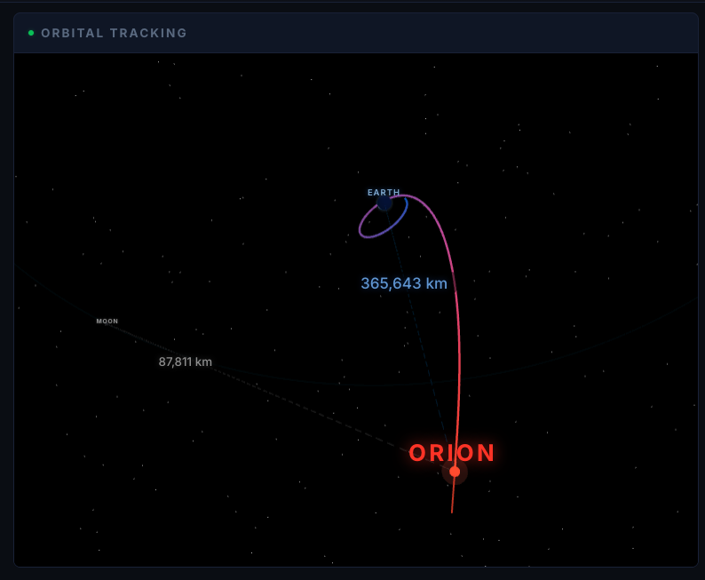

# I Tracked a Spacecraft to the Moon Using Databricks, Claude, and Genie

*And it was the most fun I've had building something in years.*

---

*Orion, 365,643 km from Earth and 87,811 km from the Moon. This is real data - every pixel of that trajectory curve comes from NASA's JPL Horizons API, rendered in real-time 3D. The blue-to-red gradient traces the spacecraft's path from launch to its current position between Earth and the Moon.*

---

I've always loved space technology. It's been a thread running through my entire life - from watching shuttle launches as a kid to the career I have now.

I've been privileged enough to partner with NASA in my work, and I even got to meet some of the earlier Artemis crew. Standing in a room with people who are training to fly to the Moon changes how you think about what's possible.

So when Artemis II launched on April 1, 2026 - the first crewed mission to the Moon in over 50 years - I didn't just want to watch. I wanted to know: *could I track a spacecraft from my own computer? Could I build my own mission control center?*

Turns out, I could.

## The data is just... there

Here's something most people don't realize: NASA publishes Orion's exact position and velocity through the JPL Horizons API. Every few minutes, you can query body ID `-1024` and get back the spacecraft's X, Y, Z coordinates in the J2000 Earth-centered inertial reference frame.

That's not an approximation. That's not a simulation. That's the actual spacecraft, tracked by the Deep Space Network's 70-meter antenna dishes in Goldstone, Canberra, and Madrid.

I pointed a Databricks ingestion job at that API. Every 5 minutes, fresh vectors. By the end of day one, I had hundreds of trajectory points. By day four, over two thousand.

## Building mission control at 3 AM

I won't pretend this was a calm, methodical engineering exercise. I was up until 3:33 AM the first night. The 3D orbit visualization kept crashing because of a WebGL buffer attribute issue in Three.js. The Lakebase connection wasn't injecting credentials. The milestones showed the wrong status.

But here's the thing - every time I fixed something and refreshed the page, I'd see real numbers change. Orion was 319,000 km from Earth. Then 340,000. Then 363,000. The velocity was dropping as the spacecraft climbed out of Earth's gravity well.

I was watching physics happen in real time, through an app I built.

*My mission control center. The telemetry ticker shows Orion at 363,307 km from Earth, 90,954 km from the Moon, traveling at 2,405 km/h on its return transit. The 3D orbital view shows the full trajectory curving around the Moon - that loop is real data from 2,011 JPL Horizons samples. Light delay: 1.21 seconds.*

## The spacecraft, up close

One of my favorite details is the interactive digital twin. It's an SVG rendering of the Orion MPCV - crew module, European Service Module, solar arrays, engine nozzle, heat shield, docking system. Click any component and a specs panel appears with real NASA-published technical data.

*The solar array wings selected - four wings with triple-junction gallium arsenide cells generating 11.1 kW. Every spec comes from NASA's published Orion documentation. The comm beam shows the DSN link back to Earth, the velocity vector shows direction of travel.*

The AJ10-190 engine? Derived from the Space Shuttle OMS. 26.7 kN thrust, 316 seconds Isp. The heat shield? AVCOAT ablative, rated for 2,760°C - because these astronauts are coming home at 25,000 mph.

None of that is made up.

## The moment Genie clicked

The app had a chat panel labeled "Mission Advisor." Originally I wired it to Claude's Foundation Model API with a fat system prompt full of mission context. It worked, but it was answering from its training data - not from *my* data.

Then I switched it to Genie.

Genie is Databricks' natural language SQL engine. You ask a question in English, it writes a SQL query, runs it against your actual tables, and answers in English. No prompt engineering. No context injection. Just: "When is the lunar flyby?" → query → "The Lunar Flyby is planned for April 6, 2026 at 12:00 UTC."

*The Mission Advisor panel. "Powered by Genie" isn't marketing - it's literally a Databricks Genie Space connected to three Unity Catalog tables. The suggestion chips give you quick questions, but you can ask anything. Next to it: DSN communications showing which ground stations have line-of-sight, and the crew roster with their current flight day activity - Manual Piloting Demo.*

That answer came from a row in a Delta table that my ingestion job wrote 5 minutes ago, synced automatically to Lakebase through a continuous synced table, queried by Genie through a SQL warehouse.

The entire Databricks stack, working together, answering a question about a spacecraft 360,000 km away.

I sat there staring at it for a while.

## How it all fits together

This is where it gets interesting from an architecture perspective. Let me walk through what happens when you open the app.

*The complete data pipeline. Real NASA sources at the top flow through a medallion lakehouse (Bronze → Silver → Gold), auto-sync to Lakebase via Synced Tables, serve 7 FastAPI endpoints, and render in two frontend views. The Horizons fallback at the bottom means the app never goes dark - even if every database is down, it queries NASA directly.*

It starts with NASA. The JPL Horizons API publishes Orion's state vectors. My ingestion notebook - which Genie's code agent actually wrote for me - hits that API every 5 minutes, pulls vectors for both Orion and the Moon, computes derived fields, and writes to Unity Catalog.

Those Delta tables have **Change Data Feed** enabled. **Lakebase Synced Tables** use that change feed to continuously replicate the data into managed PostgreSQL. No ETL code. No cron job. One command per table and it just... works.

The FastAPI backend reads from either source - SQL Warehouse for queries, Lakebase for fast reads. Every endpoint has a triple fallback: try DB → try Horizons live → return hardcoded real data. The app literally cannot show fake data. It either shows real data or it shows nothing.

## Keeping it healthy

*The operations view. Six data sources, all healthy. 6/6 green. 2,011 trajectory points. Zero errors. The diagnostics are computed from the cached API responses themselves - each source card tells you whether it's live, when it was last updated, and what it contains.*

The diagnostics page isn't just for show. During development, this is how I caught problems - stale data, failed ingestion runs, permission errors. Each source card is a real health check computed from the live endpoint responses.

## The stack

I used almost every Databricks product that made sense:

- **Databricks Apps** - FastAPI + React, deployed with one command
- **Unity Catalog** - Delta tables with Change Data Feed
- **Lakebase** - Managed PostgreSQL with continuous Synced Tables
- **Genie Space** - Natural language mission intelligence
- **AI/BI Dashboard** - Published Lakeview dashboard
- **Scheduled Jobs** - Genie-generated ingestion every 5 minutes
- **SQL Warehouse** - Serverless query engine

Claude helped me build the entire thing. Every component, every API endpoint, every CSS rule. I'd describe what I wanted, and it would write the code, debug it, deploy it, and tell me to refresh.

The combination of Claude for building and Genie for querying is something I hadn't experienced before. One AI builds the system. Another AI understands the data inside it. Together they made it possible to go from "I want to track a spacecraft" to a live mission control center in under 48 hours.

## Why this matters (to me)

I'm not building a product here. I'm not selling anything. This app will be irrelevant by April 10 when Orion splashes down in the Pacific.

But for these 10 days, I have my own mission control. I can watch four humans travel farther from Earth than anyone has in half a century. I can ask an AI "how far is the Moon right now?" and get a real answer from real data.

Having partnered with NASA, having met the people who make these missions possible, this feels personal. This isn't just a demo. It's a way of being part of something extraordinary, even from my desk.

There's a NASA Live video feed in the corner of the spacecraft attitude panel. Sometimes I just leave it running while I work. Orion is out there, 360,000 km away, and my little Databricks app knows exactly where it is.

Tomorrow is the lunar flyby. Closest approach: ~6,400 km from the surface. The crew will photograph the far side of the Moon. My trajectory visualization will show the path curving around and heading back toward Earth.

I'll be watching. Through an app I built. With real data. Because I could.

---

*The Artemis II Mission Tracker is live at [artemis-tracker-7474647106303257.aws.databricksapps.com](https://artemis-tracker-7474647106303257.aws.databricksapps.com). Source code on [GitHub](https://github.com/Reishin-DB/artemis-tracker).*
