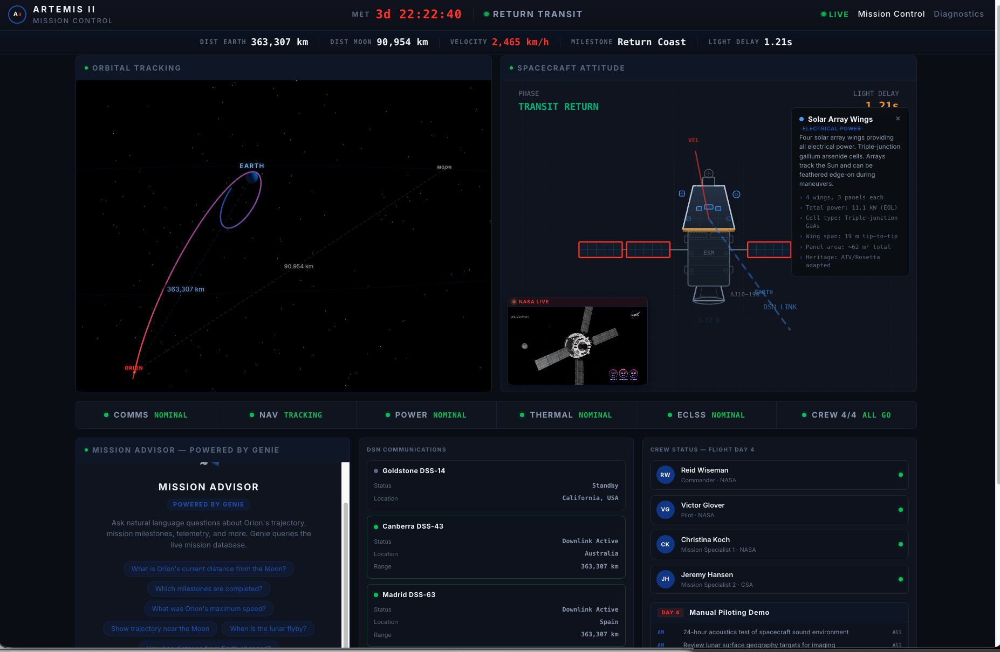
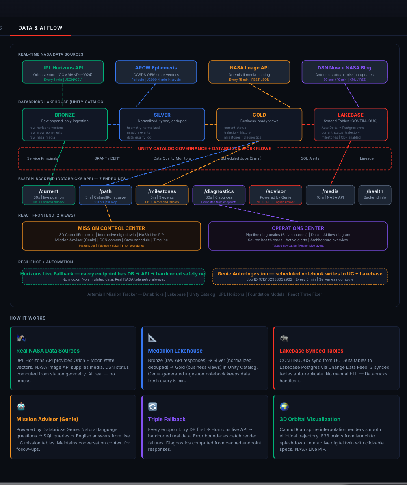
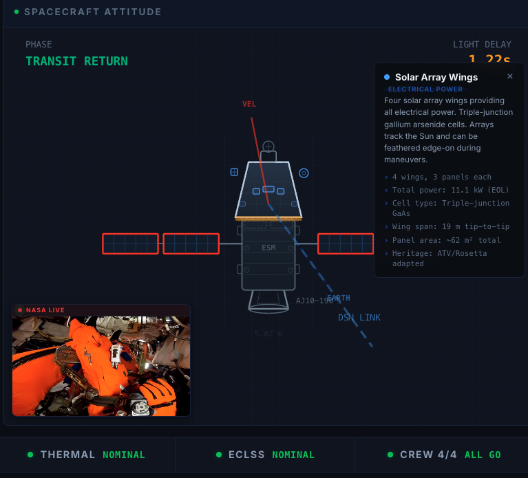
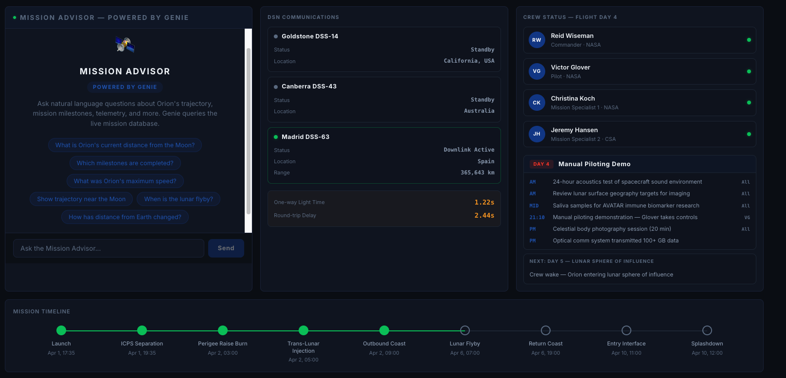
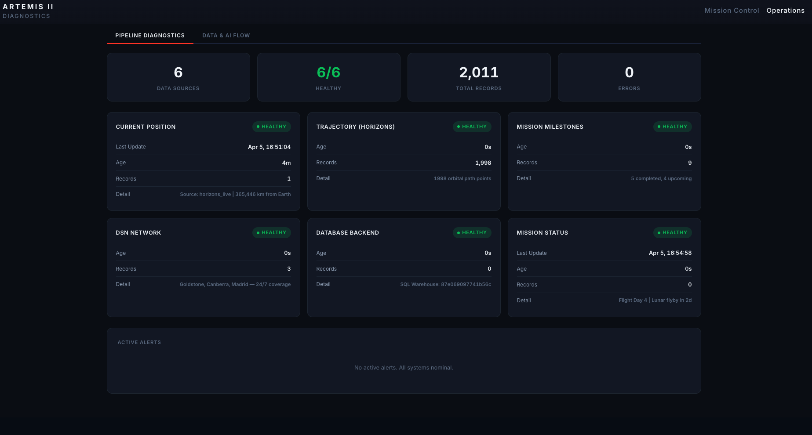

# Artemis II Mission Tracker

Real-time NASA Artemis II spacecraft tracking built entirely on Databricks.



## Overview

A NASA-style Mission Control Center that tracks the Orion spacecraft during the Artemis II lunar mission using live data from JPL Horizons API. Built in under 48 hours while the spacecraft was in transit.

## Features

- **3D Orbital Visualization** - CatmullRom-interpolated trajectory with Earth, Moon, and Orion
- **Interactive Digital Twin** - Clickable Orion MPCV with real NASA specs for every component
- **Mission Advisor (Genie)** - Natural language queries against live mission data
- **Crew Schedule** - Real NASA daily agenda for all 10 flight days
- **DSN Communications** - Deep Space Network station visibility
- **Pipeline Diagnostics** - Live health monitoring of 6 data sources
- **Data & AI Flow** - Full architecture diagram

## Databricks Stack

| Product | Usage |
|---------|-------|
| **Databricks Apps** | FastAPI + React frontend |
| **Unity Catalog** | Delta tables with Change Data Feed |
| **Lakebase** | Managed PostgreSQL with Synced Tables (CONTINUOUS) |
| **Genie Space** | Natural language mission intelligence |
| **AI/BI Dashboard** | Published Lakeview dashboard |
| **Scheduled Jobs** | Genie-generated ingestion every 5 min |
| **SQL Warehouse** | Serverless query engine |

## Architecture



```
JPL Horizons API (every 5 min)
    |
Databricks Scheduled Job (Genie-generated notebook)
    |
Unity Catalog Delta Tables (CDF enabled)
    |                           |
Lakebase Synced Tables     Genie Space
    |                           |
FastAPI Backend            Mission Advisor
    |
React Frontend (Databricks App)
```

## Data Sources

All data is real and live from NASA:

- **JPL Horizons API** - Orion state vectors (body ID -1024) + Moon vectors (body ID 301)
- **NASA Daily Agenda** - Official crew activity schedule for each flight day
- **NASA Orion Specs** - Published spacecraft technical specifications

No simulated data. No mocks.

## Screenshots

| Mission Control | Spacecraft Digital Twin |
|---|---|
|  |  |

| Mission Advisor (Genie) | Pipeline Diagnostics |
|---|---|
|  |  |

## Project Structure

```
artemis-tracker/
  app/
    api/          # FastAPI endpoints (current, path, milestones, diagnostics, advisor)
    frontend/     # React + TypeScript + Three.js
    static/       # Built frontend assets
    main.py       # FastAPI app
    db.py         # Database layer (Lakebase + SQL Warehouse + Horizons fallback)
  notebooks/      # Databricks notebooks (ingestion, transforms, sync)
  screenshots/    # App screenshots
  app.yaml        # Databricks App config with Lakebase resource
```

## Built With

- **Claude (AI Dev Kit)** - AI pair programmer that built the entire application
- **Genie Code** - Generated the 740-line ingestion notebook
- **Genie Space** - Powers the Mission Advisor chat

## Disclaimer

This is a demonstration project built for educational and showcase purposes only. It is not affiliated with, endorsed by, or connected to NASA, JPL, or the Artemis program. All NASA data is sourced from publicly available APIs. Spacecraft specifications are from publicly published NASA documents.

## License

MIT License - See [LICENSE](LICENSE) file.
